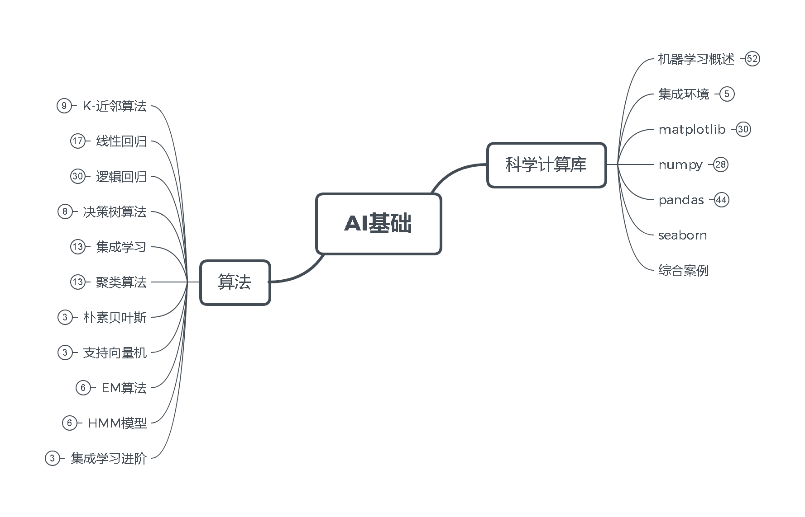
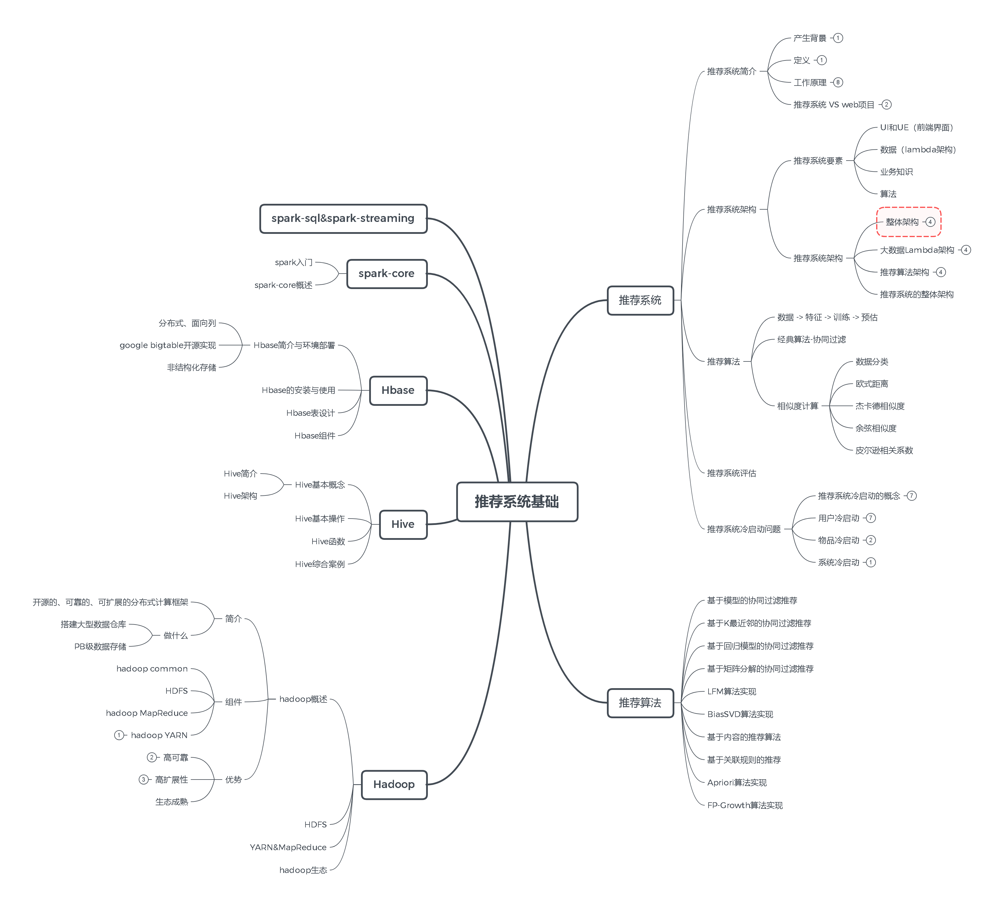
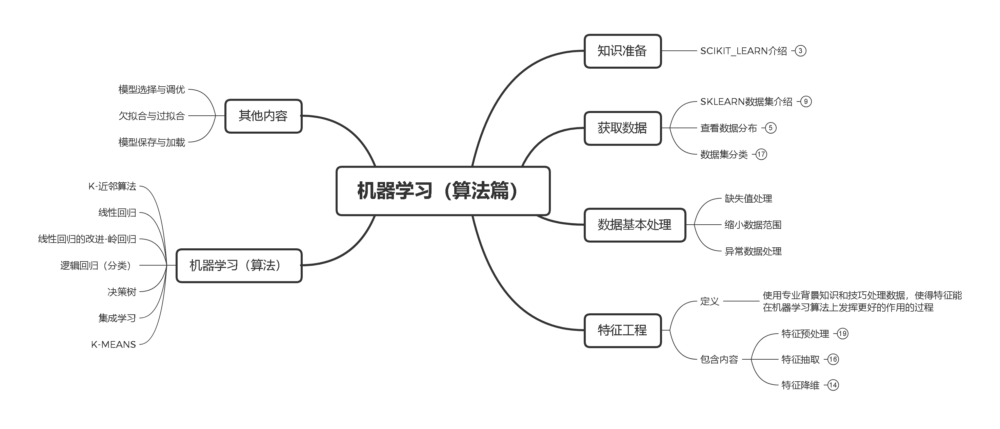
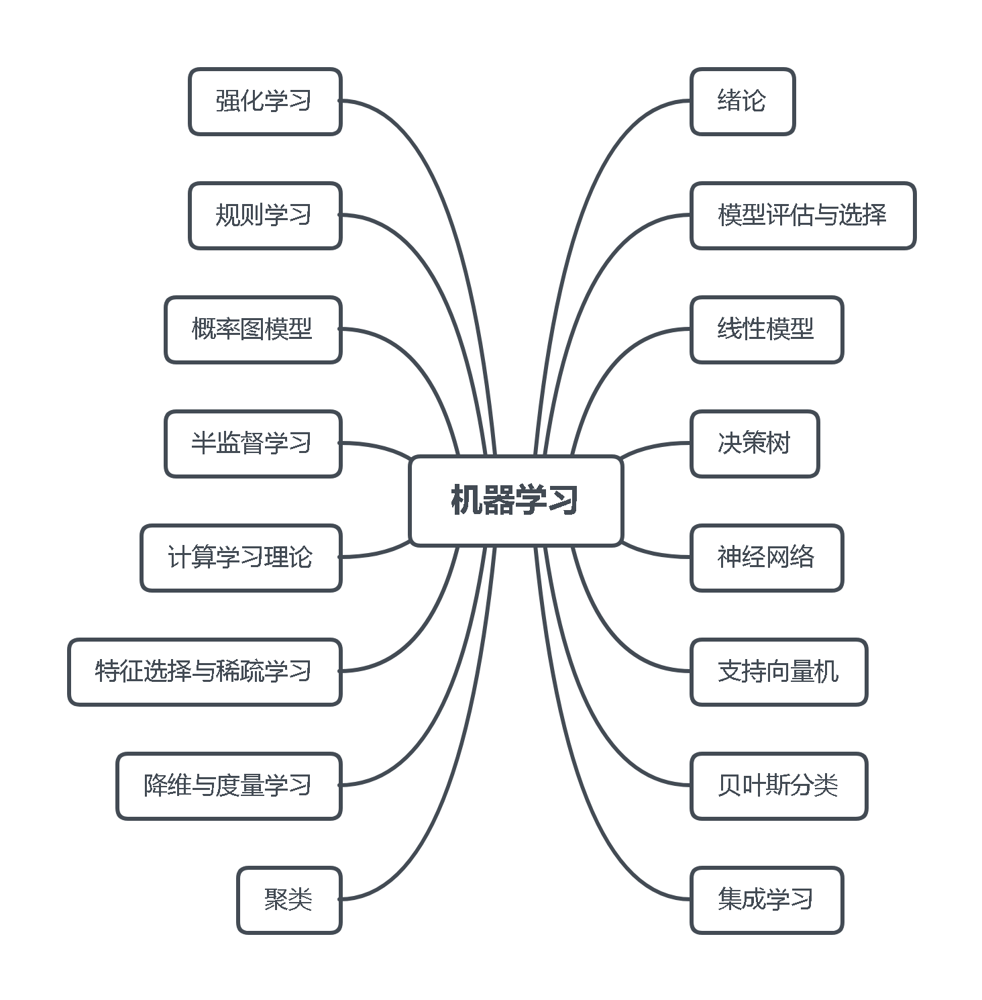
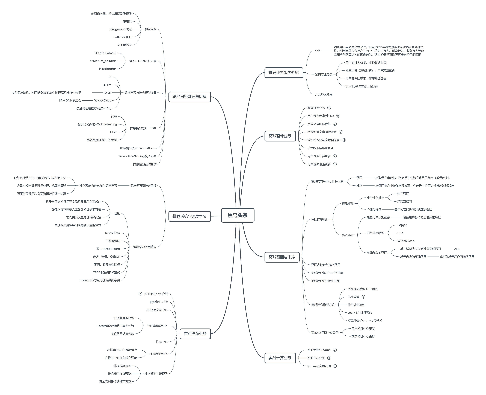
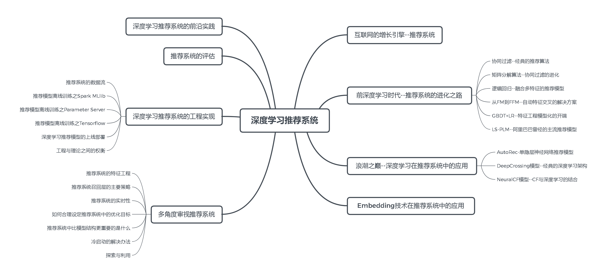

# 人工智能

## 主要分支
- 计算机视觉（CV） 图像形成、图像处理、图像提取
- 自然语言处理（NLP）
  - 语音识别
  - 文本挖掘/分类
  - 机器翻译
- 机器人

## lib
- matplotlib
- numpy
- pandas
- sklearn
- pytorch
- mxnet

## Overview

### AI基础

### 推荐系统基础

### 机器学习（算法篇）

### 机器学习

### 黑马头条

### 深度学习推荐系统
