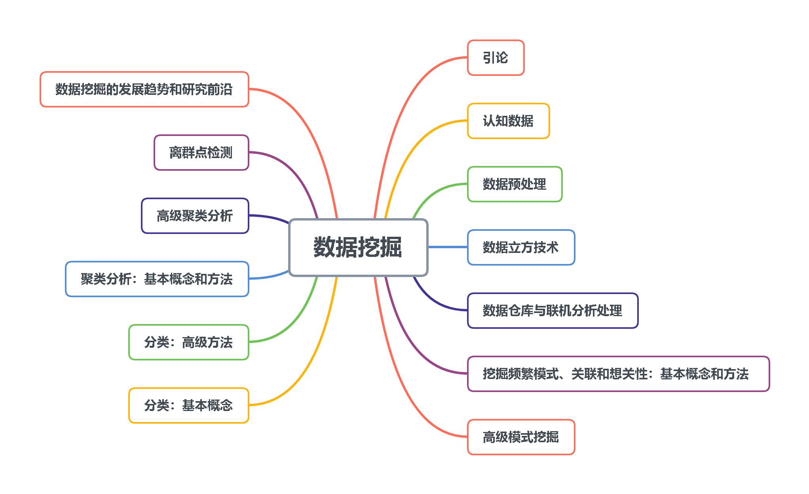
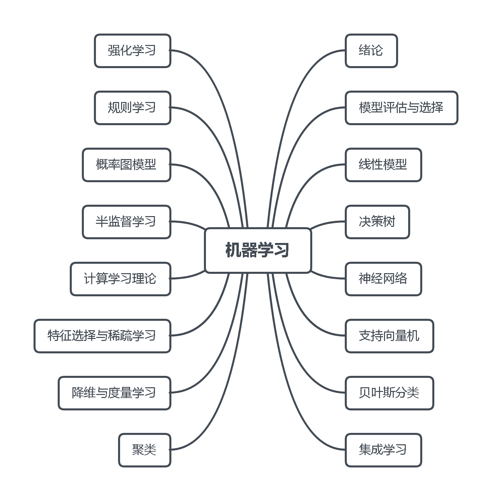
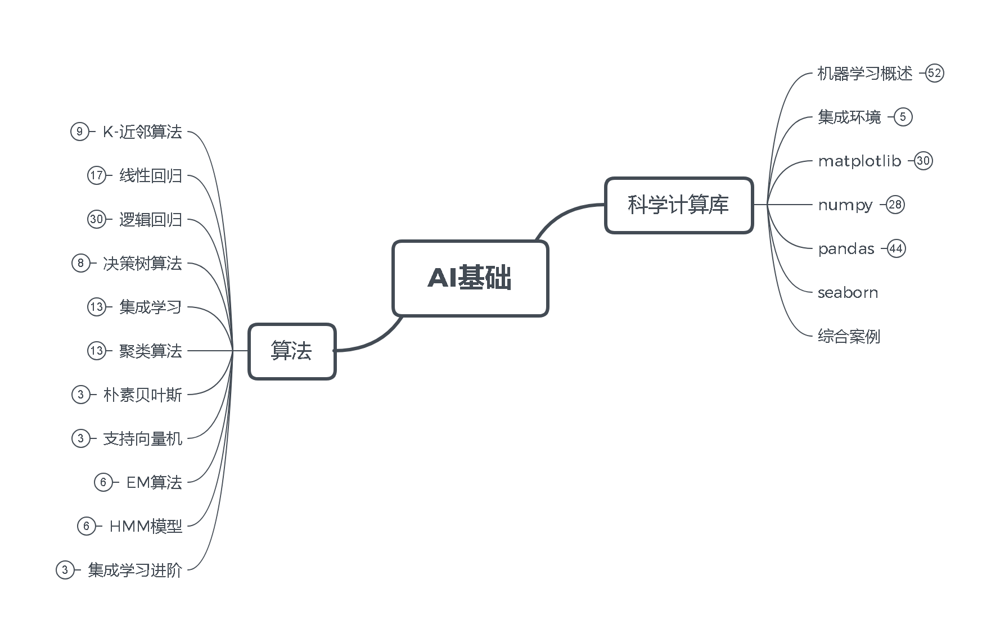
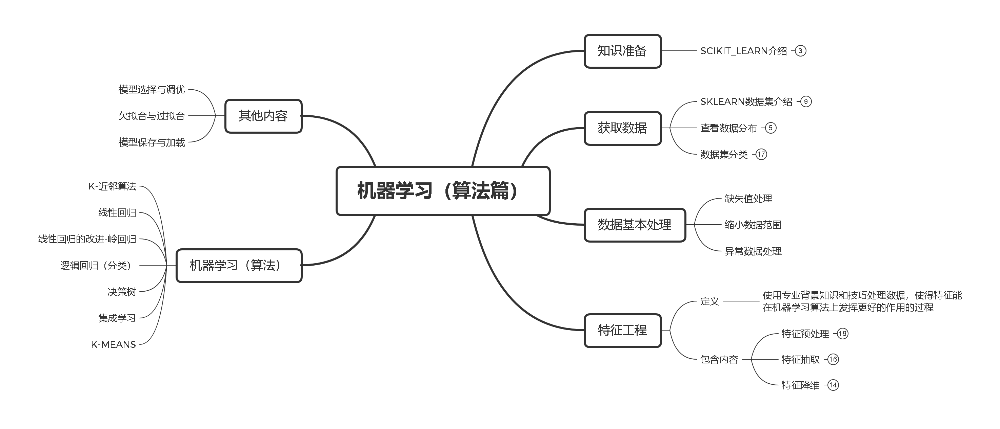

# 人工智能

## 主要分支
- 计算机视觉（CV） 
  - 图像形成、图像处理、图像提取。
  - 物体检测和人脸识别。
- 自然语言处理（NLP）
  - 语音识别
  - 机器翻译
  - 文本挖掘/分类
- 机器人

`人工智能`是让机器获得像人类一样具有思考和推理机制的智能技术， 这一概念最早出现在 1956 年召开的达特茅斯会议上。
让机器自动从数据中学习规则的研究学科诞生了，称为`机器学习`。
在机器学习中，有一门通过神经网络来学习复杂、抽象逻辑的方向，称为`神经网络`。
`深度学习`特指基于深层神经网络实现的模型或算法。 

## Overview
- [机器学习](/AI/heima/黑马-机器学习.md)
- [机器学习-科学计算库](/AI/heima/科学计算库.md)
- [机器学习-算法](/AI/heima/算法.md)
- [Google机器学习](/AI/google/Google机器学习.md)

### 数据挖掘

### 机器学习-周志华

### AI基础

### 机器学习（算法篇）

