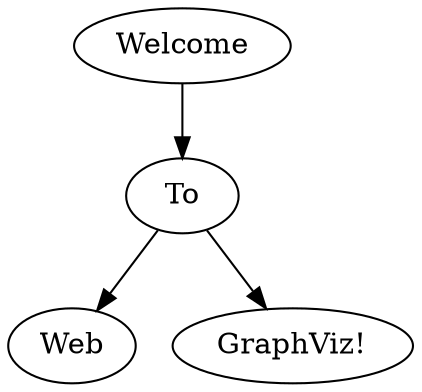

# 算法

1. K近邻
2. 线性回归
3. 逻辑回归
4. 决策树算法
5. 集成学习
6. 聚类算法
7. 朴素贝叶斯
8. 支持向量机
9. EM 期望最大化
10. HMM

## 1. K近邻

### 1.1 K-近邻算法简介
如果⼀个样本在特征空间中的k个最相似(即特征空间中最邻近)的样本中的⼤多数属于某⼀个类别，则该样本也属于这个类别。
1. 计算已经类别数据集中的点与当前点之间的距离
2. 按距离递增次序排列
3. 选取与当前点距离最小的k个点
4. 统计前k个点所在的类别出现的频率
5. 返回前k个点出现频率最高的类别作为当前点的预测分类

通过你的“邻居”来判断你属于哪个类别。一般通过欧式距离计算。
### 1.2 K近邻算法api
scikit-learn
- classification
- regression
- clustering
- dimensinoality reduction
- model selection
- preprocessing

```py
import sklearn.neighbors import KNeighborsClassifier
# 获取数据，数据预处理，特征工程
x = [[0], [1], [2], [3]]
y = [0, 0, 1, 1]
# 机器学习 估计函数、预估程序、估计器
estimator = KNeighborsClassifier(n_neighbors=1)
estimator.fit(x, y)
# 模型评估
estimator.predict([[1]])
```

### 1.3 距离度量
距离公式基本性质：非负性、统一性、对称性、直递性

常见的距离公式
- 欧氏距离 
  - 2维：$ \displaystyle d_{12} = \sqrt{(x_1 - x_2)^2 + (y_1 - y_2)^2} $
  - n维：$ \displaystyle d_{12} = \sqrt{\sum_{k=1}^n(x_{1k} - x_{2k})^2} $
- 曼哈顿距离
  - 2维：$ \displaystyle d_{12} = |x_1 - x_2| + |y_1 - y_2| $
  - n维：$ \displaystyle d_{12} = \sum_{k=1}^n|x_{1k} - x_{2k}| $
- 切比雪夫距离 
  - 2维：$ \displaystyle d_{12} = max(|x_1 - x_2|, |y_1 - y_2|) $
  - n维：$ \displaystyle d_{12} = max(x_{1i} - x_{2i}) $
- 闵可夫斯基距离，不是一种距离，而是一组距离的定义，是对多个距离度量公式的概括性的表述。
  - $ \displaystyle d_{12} = p \sqrt{\sum_{k=1}^n|x_{1k} - x_{2k}|^p} $
  - 其中p是一个参数
    - 当p=1时，曼哈顿距离
    - 当p=1时，欧式距离
    - 当p趋向无穷大，切比雪夫距离
- 标准化欧式距离
- 余弦距离
  - $ \displaystyle  cos(\theta) = \frac {\vec{a} \cdot \vec{b}}{|\vec{a}||\vec{b}|} $
- 汉明距离
- 杰卡德距离
- 马氏距离

### 1.4 k值选择
- k值过小
  - 容易受到异常点的影响
  - 容易过拟合
- k值过大
  - 受到样本均衡的问题
  - 容易欠拟合

### 1.6 案例一
sklearn.datasets
- 加载后期流行数据集
- datasets.load_*() 获取小规模数据集
- datasets.fech_*(data_home=None) 获取大规模数据集

```py
# 获取数据集
sklearn.datasets.load_iris()
sklearn.datasets.fetch_20newsgroups(data_home=None, subset='train')
# 数据集的划分
sklearn.model_selection.train_test_split(arrays, *options)
```

### 1.7 特征工程-特征预处理
通过**⼀些转换函数**将特征数据**转换成更加适合算法模型**的特征数据过程
- 归一化：通过对原始数据进行变换把数据映射到（默认为[0,1]）之间
- 标准化：通过对原始数据进⾏变换把数据变换到均值为0,标准差为1范围内

```py
sklearn.preprocessing
# 归一化
sklearn.preprocessing.MinMaxScaler (feature_range=(0,1)… )
MinMaxScalar.fit_transform(X)
# 标准化
sklearn.preprocessing.StandardScaler( )
StandardScaler.fit_transform(X)
```

### 1.9 KNN算法总结
- 优点
  - 简单有效
  - 重新训练的代价低
  - 适合类域交叉样本
  - 适合大样本自动分类
- 缺点
  - 惰性学习
  - 类别评分不是规则化
  - 输出可解释性不强
  - 对不均衡的样本不擅长
  - 计算量较大

### 1.10 交叉验证
交叉验证，将拿到的训练数据，分为训练和验证集。**为了让从训练得到模型结果更加准确**（交叉验证的目的）。
  - 训练集：训练集 + 验证集
  - 测试集
- 网格搜索
  - 很多参数是需要手动指定的（如k-近邻算法中的K值），这种叫**超参数**。
  - 每组超参数都采⽤交叉验证来进⾏评估。最后选出最优参数组合建⽴模型。
  - ⽹格搜索就是把这些超参数的值,通过字典的形式传递进去,然后进⾏选择最优值

```py
sklearn.model_selection.GridSearchCV(estimator, param_grid=None,cv=None)
```

## 2. 线性回归

### 2.4 线性回归的损失与优化
损失函数，最小二乘法

- 正规方程
  - 一次运算得出
  - 需要计算方程，时间复杂度高O(n3)
- 梯度下降
  - 需要选择学习率
  - 需要迭代求解
  - 特征数量较大可以使用

### 2.5 梯度下降法
- 在单变量的函数中，梯度其实就是函数的微分，代表着函数在某个给定点的切线的斜率；
- 在多变量函数中，梯度是一个向量，向量有方向，梯度的方向就指出了函数在给定点的上升最快的方向；

算法选择依据
- 小规模数据：
  - 正规方程：LinearRegression(不能解决拟合问题)
  - 岭回归
- 大规模数据：
  - 梯度下降法：SGDRegressor

全梯度下降法 FG
随机梯度下降法 SG
小批量梯度下降法 MG
随机平均梯度下降法 SAG

### 2.8 欠拟合和过拟合
- Undefitting, 欠拟合 训练集表现不好，测试集表现不好 ---- 模型过于简单
  - 原因，学习到的数据特征过少
  - 解决方法
    - 添加其他特征项
    - 添加多项式特征
- overfitting, 过拟合 训练表现集好，测试集表现不好 ---- 模型过于复杂
  - 原因，原始特征过多，存在一些嘈杂特征，模型过于复杂是因为模型尝试区兼顾各个测试数据点
  - 解决方法
    - 重新清洗数据
    - 增大数据的训练度
    - 正则化
    - 减少特征维度，防止维灾难

正则化，尽量减少高次项特征的影响
- L1正则化，高次项系数变0，尖点、不可导
  - 可以使得其中的一些W的值直接为0，删掉这个特征的影响
  - LASSO回归
- L2正则化，高次项系数变得很小，平滑曲线
  - 可以使得其中一些W的值都很小，都接近于0，削弱某个特征的影响
  - Ridge回归，岭回归

随着维度的增加，分类器的性能逐步上升，到达某个点之后，其性能便逐步下降

### 2.9 正则化线性模型
- Ridge Regression 岭回归，线性回归的正则化版本，在原有的线性回归的cost function中添加正则项 $ \displaystyle \alpha\sum_{i=1}^{n}\theta_i^2 $
- Lasso Regression
- Elastic Net 弹性网络
- Early stopping

```python 
sklearn.linear_model.RidgeCV()
```

正则化力度越大，权重系数越小。

## 3. 逻辑回归

### 3.1 逻辑回归介绍
应用场景
- 广告点击率
- 是否为垃圾邮件
- 是否患病
- 金融诈骗
- 虚假账号

逻辑回归原理
- 输入 $ h(w) = w_1x_1 + w_2x_2 + w_3x_3 + ... + b $
- 激活函数 $ g(w^T, x) = \frac 1{1 + e^{-h(w)}} = \frac 1{1 + e^{-w^Tx}} $

### 3.2 逻辑回归api

### 3.4 分类评估方法
- 准确率
  - (TP + TN) / (TP + TN + FN + FP)
- 精确率
  - TP / (TP + FP)
- 召回率
  - TP / (TP + FN)
- F1-score
  - 反映模型的稳健性
- 真正例率
- 假正例率
- ROC Reciever Operating Characteristic
- AUC Aear Under ROC Curve
  - 只能用来评价二分类
  - 非常适合评价样本不平衡中的分类器性能

```py
from sklearn.metrics import roc_auc_score
sklearn.metrics.roc_auc_score(y_ture, y_score)
# [0.5, 1]区间,越接近1越好
y_test = np.where(y_test > 2.5, 1, 0)
```

## 4. 决策树算法
决策树是一种树形结构，本质是一颗由多个判断节点组成的树。
### 4.2 决策树分类原理
决策树的划分依据
- 熵
- 信息熵
- 信息增益--ID3决策树
- 信息增益率--C4.5决策树
- 基尼值
- 基尼指数--CART决策树

基尼值Gini（D）： 从数据集D中随机抽取两个样本，其类别标记不⼀致的概率。 故，Gini（D）值越⼩，数据集D的纯度越⾼。
基尼指数Gini_index（D）： ⼀般，选择使划分后基尼系数最⼩的属性作为最优化分属性。

### 4.3 CART剪枝
classification and regression tree

剪枝是决策树学习算法对付**过拟合**的主要手段。
- 剪枝原因
  - 噪声、样本冲突、即多无的样本数量
  - 特征即属性不能完全作为分类标准
  - 巧合的规律性，数据量不够大
- 常用的剪枝方法
  - 预剪枝
    - 在构建树的过程中，同时剪枝
    - 限制节点的最小样本数
    - 指定数据高度
    - 指定熵值的最小值
  - 后剪枝
    - 把一棵树，构建完成之后，再进行从下往上的剪枝

### 4.4 特征工程-特征提取
将任意数据（如文本或图像）转换为可用于机器学习的数字特征。特征提取分类:
- 字典特征提取（特征离散化）
- 文本特征提取
- 图像特征提取（深度学习介绍）

```py
sklearn.feature_extraction
# 字典特征提取
sklearn.feature_extraction.DictVectorizer(sparse=True,...)
DictVectorizer.fit_transform(X)
DictVectorizer.get_feature_names()
# 文本特征提取
sklearn.feature_extraction.text.CountVectorizer(stop_words=[])
CountVectorizer.fit_transform(X)
CountVectorizer.get_feature_names()
sklearn.feature_extraction.text.TfidfVectorizer
```



### 4.5 决策树算法api
### 4.6 回归决策树

## 5. 集成学习
### 5.1 集成学习算法简介
集成学习通过建立几个模型来解决单一预测问题。它的工作原理是生成多个分类器/模型，各自独立地学习和作出预测。
这些预测最后结合成组合预测，因此优于任何一个单分类的作出预测。

机器学习两个核心任务
- 如何**优化训练数据**，主要用于解决**欠拟合**问题
  - 弱弱组合变强
  - boosting逐步增强学习
- 如何**提升泛化能力**，主要用于解决**过拟合**问题
  - 相互遏制变壮
  - Bagging采样学习集成

### 5.2 Bagging和随机森林
- Bagging
  - 采样，采样不同数据
  - 学习，训练分类器
  - 集成，平权投票，获取最终结果
- 随机森林是一个包含**多个决策树**的分类器，并且输出的类别是由个别树输出类别的**众数**而定。
  - 随机森林 = Bagging + 决策树
  - 流程
    1. 随机选取m条数据
    2. 随机选取k个特征
    3. 训练决策树
    4. 重复1-3
    5. 对上面的决策树进行平权投票
  - 注意
    - 随机选择样本，且是有放回的抽样
    - 选取特征的时候，选择`m<<M`
    - M是所有的特征数
  - 包外估计
    - 如果进行有放回的数据集抽样，会发现总有一部分样本选不到。
  - api
    - sklearn.ensemble.RandomForestClassifier()


### 5.3 随机森林案例
### 5.4 Boosting介绍
随着学习的积累由弱变强，每加入一个弱学习器，整体能力就会得到提升。代表算法，Adaboost，GBDT，XGBoost，LightGBM
- 实现过程
  - 训练第一个学习器
  - 调整数据分布
  - 训练第二个学习器
  - 再次调整数据分布
  - 依次训练学习器，调整数据分布

Bagging与Boosting的区别
1. 数据方面
   - bagging 对数据进行采样训练
   - boosting 根据前一轮学习结果调整数据的重要性
2. 投票方面
   - bagging 所有学习器平权投票
   - boosting 对学习器进行加权投票
3. 学习顺序
   - bagging学习是并行的，每个学习器之间没有依赖关系
   - boosting学习是串行的，学习有先后关系
4. 主要作用
   - bagging用于提高泛化能力（解决过拟合，降低方差）
   - boosting用于提高训练精度（解决欠拟合，降低偏差）

### 5.5 GBDT介绍
梯度提升决策树
- Decision Tree，CART回归树
- Gradient Boosting，拟合负梯度

## 6. 聚类算法
### 6.1 聚类算法简介
- 使用不同的聚类准则，产生的聚类结果不同。分为组聚类、细聚类。
- 聚类算法：一种典型的无监督学习算法，主要用于将**相似的样本**自动归到一个类别中。
  - 计算样本的相似性，一般使用欧氏距离
  - 聚类算法是无监督学习算法，分类算法属于监督学习算法。

### 6.2 聚类算法api
- sklearn.cluster.KMeans(n_clusters=8)
  - n_clusters
  - estimator.fit(x)
  - estimator.predict(x)
  - estimator.fit_predict(x)

```py
import matplotlib.pyplot as plt
from sklearn.datasets.samples_generator import make_blobs
from sklearn.cluster import KMeans
from sklearn.metrics import calinski_harabaz_score
```
### 6.3 聚类算法实现流程
k-means
- k 初始中心点个数，计划聚类类别
- means 求中心点到其他数据点距离的平均值

### 6.4 模型评估
误差平方和（SSE、The sum of squares due to error）
### 6.5 算法优化
### 6.6 特征降维
降维是指在某些限定条件下，降低随机变量（特征）个数，得到**一组“不相关”主变量**的过程。特征降维的两种方式，特征选择与主成分分析。
#### 6.6.2 特征选择
- 定义：数据中包含冗余或⽆关变量（或称特征、属性、指标等），旨在从原有特征中找出主要特征。
- 方法
  - filter过滤式
  - Embedding嵌入式
- 低方差特征过滤
  - API
  - 数据计算
- 相关系数
  - 皮尔逊相关系数
  - 斯皮尔曼相关系数

#### 6.6.3 主成分分析
- 定义：⾼维数据转化为低维数据的过程，在此过程中可能会舍弃原有数据、创造新的变量
- 作⽤：是数据维数压缩，尽可能降低原数据的维数（复杂度），损失少量信息。
- 应⽤：回归分析或者聚类分析当中

#### 6.6.8 算法选择指导

## 7. 朴素贝叶斯

## 8. 支持向量机
- SVM
- SVM api
- SVM算法原理

## 9. EM期望最大化
- EM

## 10. HMM
- 马尔科夫链
- HMM

### 11. 基础学习进阶
- xgboost
- lightGBM